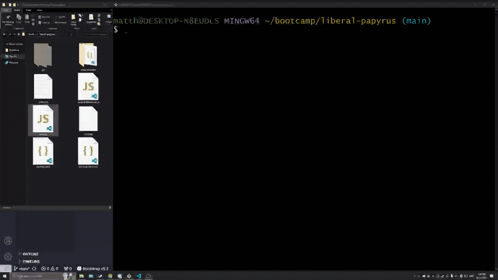

# Professional Readme Generator

## Description
A command-line application that creates a high quality README file from user input

## Table of Contents

- [Installation](#installation)
- [Usage](#usage)
- [License](#license)
- [How to Contribute](#contributing)
- [Tests](#tests)
- [Questions](#questions)

## Installation
Clone and run index.js through a JSRE (ie node.js)

## Usage
Answer promopts that sequentially appear on screen until all necessary data is acquired, then the README will be generated from the responses given

## License
This project is licenced under [MIT License](https://choosealicense.com/licenses/mit)

## Contributing
This project is not currently seeking any collaborators

## Tests
This project does not currently implement any test functionality

## Questions
If you have any questions or concerns regarding this project, I can be contacted via email at the following address
mgalvin1993@gmail.com
Additionally my github profile can be located by using the following link
https://github.com/galvin-sh

